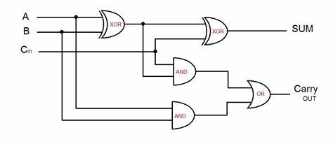
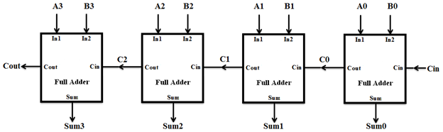
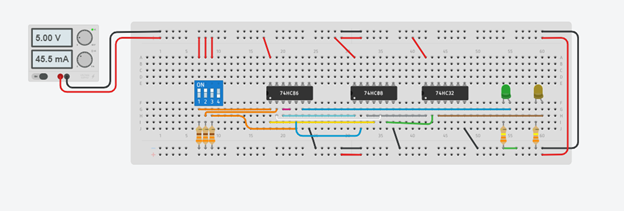
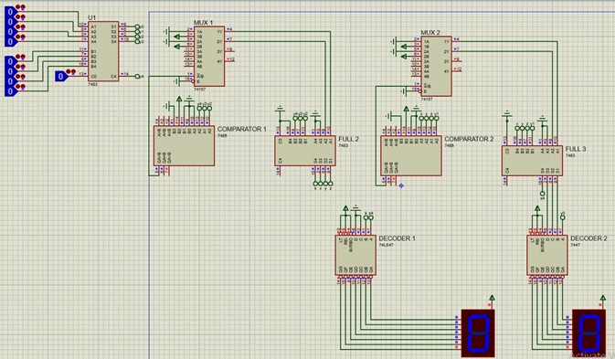

# 4-Bit Full Adder Circuit – Logic Circuits I Project

## 🧠 Problem Statement

Design a 4-bit full adder circuit to sum two unsigned 4-bit numbers and display the result on a 7-segment display.

---

## 💡 Solution Overview

We implemented a 4-bit full adder to sum two binary numbers. The output was decoded using **Excess-3 BCD encoding**:

- Incremented the three least significant bits by 1.
- Decoded each 4-bit segment using **BCD code**.
- This was done twice for each 2-bit pair of the sum.

### Data Flow:
1. Output of the full adder was passed through:
   - Comparator `[7485]`
   - Multiplexer `[74157]`
   - Full Adder `[7483]`
2. Carry routed through a BCD decoder `[7447]` to show the **tens** digit.
3. The sum routed through another decoder to display the **units** digit.

---

## 🧩 Components Used

- `2x` 4-DIP Switches  
- `3x` Full Adder ICs `[7483]`  
- `2x` Comparator ICs `[7485]`  
- `2x` Multiplexer ICs `[74157]`  
- `2x` BCD Decoder ICs `[7447]`  
- `2x` 7-Segment Common Anode Displays  
- `330Ω` Resistors  

---

## 📋 Truth Table for 1-Bit Full Adder

| A | B | Cin | Sum | Cout |
|---|---|-----|-----|------|
| 0 | 0 |  0  |  0  |  0   |
| 0 | 0 |  1  |  1  |  0   |
| 0 | 1 |  0  |  1  |  0   |
| 0 | 1 |  1  |  0  |  1   |
| 1 | 0 |  0  |  1  |  0   |
| 1 | 0 |  1  |  0  |  1   |
| 1 | 1 |  0  |  0  |  1   |
| 1 | 1 |  1  |  1  |  1   |

---

## 🧮 Karnaugh Maps & Minimization

### Sum

- Minterms: `m(1, 2, 4, 7)`
- Simplified:
  Sum = AB'C' + A'B'C + ABC + A'BC' = C(AB + A'B') + C'(A'B + AB') = C ⊕ (A ⊕ B)

### Carry

- Minterms: `m(3, 5, 6, 7)`
- Simplified:
  Cout = AB + AC + BC

---

## 🔧 Circuit Diagrams

### Single Bit Full Adder Circuit Diagram

### 4-Bit Full Adder Block Diagram

---

## 🧪 Simulations

### Simulation for the Single-Bit Full Adder

### Simulation for the 4-Bit Full Adder

